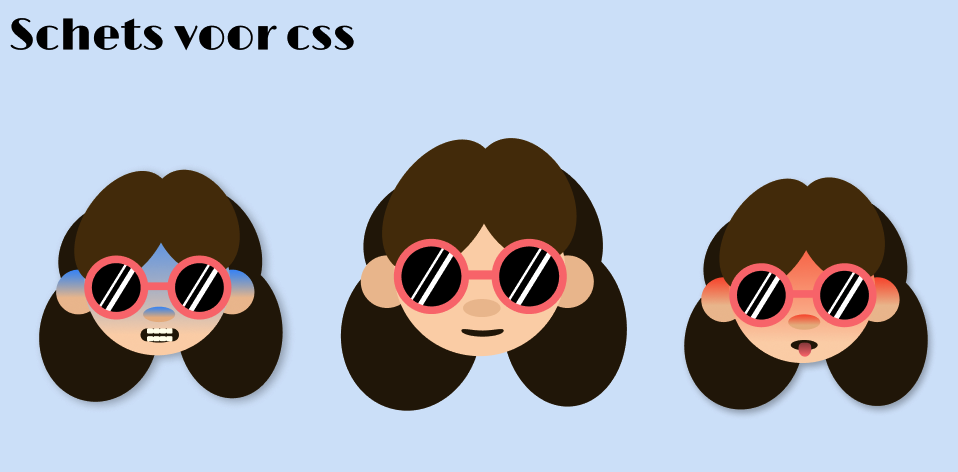
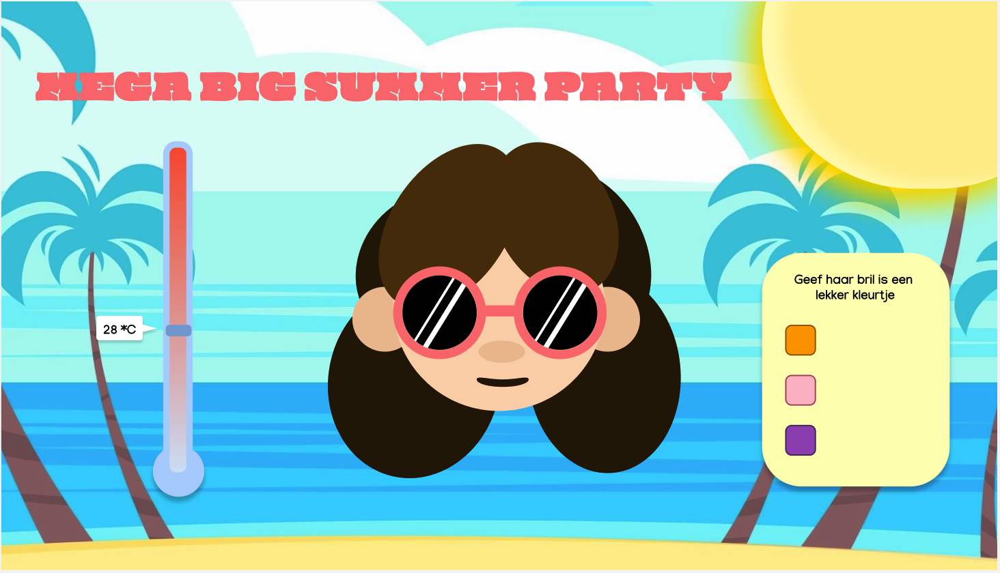
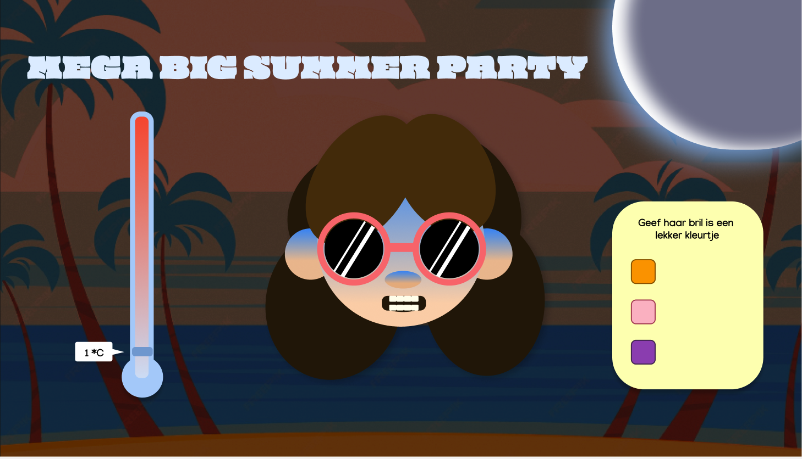

# CSSttR
CSS to the rescue

Hoi! Welkom bij mijn readme:

Ik heb de opdracht control panel gekozen.

====WEEK 1=====

Dinsdag hebben wij over een eerste idee gebrainstormd.
Mijn idee is een vakantie meisje met een slider ernaast waardoor je de temperatuur kan aanpassen. Als je naar 0 slide krijgt ze t koud en word ze blauw. Als ze het warm krijgt word ze rood. Ook kan je met radio buttons de kleur van haar zonnebril aanpassen. En doormiddel van de zon kan je light en dark mode aanpassen. Als het in dark mode staat (dus avond is), word de temperatuur automatisch koud en het meisje blauw. Meer ideen volgen nog :3.

Eerste idee

Tweede idee

Uiteindelijk heb ik gekozen voor het 2de idee.

====WEEK 2=====

Ik ben deze week begonen met het maken van het hoofd, ik heb nog nooit eerder iets getekend met css dus dit was een behoorlijke uitdaging. Ik had eerst in canva mijn idee uitgewerkt en een hoofdje van simpele blokken gemaakt zodat ik die makkelijk na kon maken. Uiteindelijk was het een iets grotere uitdaging dan ik had verwacht om alles goed te positioneren.

Op dinsdag was ik begonnen met de radio buttons aan het werk te krijgen. Dit heb ik gedaan met een :has selector die ik ook nog nooit had gebruikt. Ik heb een cursusje bij Roel gevolgd over de :has selector om te begrijpen wat je er allemaal mee kan. 
Ook had ik met Sanne een cursusje gevolgt over gradients. Dit heb ik gebruikt in de zonnebril. De gradient heb ik met een keyframe animatie geanimeerd. (hier heeft Sanne wel bij geholpen dus credits.)

Ik had in het begin inplaats van normale tags op een lichtelijk ilegale manier gewerkt door alles te benoemen als wat het was. Dit heb ik veranderd door inplaats van bijvoorbeeld <oor>, <aside> te gebruiken. Omdat je geen classes mocht gebruiken bij dit project heb ik zoveel mogelijk verschillende tags gebruikt zodat het makkelijk is om aan te spreken in css. Ik heb overal in comments bij gezet wat het is zodat ik het voormezelf overzichtelijk houd.
 
====WEEK 3=====

Deze week waagde ik mij aan de slider. Met een cursusje van Sanne had ik gelukkig een opstapje met wat ik moest doen. Ik had eerst zelf een slider gemaakt die ik heb gestijld naar een een thermometer. Dit wat moeilijker dan verwacht.. 
Ik had eerst de slider verticaal gemaakt doormiddel van: writing-mode:vertical-lr; en daarna de standaard styling eraf gehaald. 
Omdat ik even een visie nodig had van waar ik precies heen moest met de styling had ik dat eerst in figma gemaakt. 
Het bolletje aan de onderkant wou ik eerst maken met een :after alleen lukt het mij niet om die onder de thermometer te krijgen. Daarom heb ik uiteindelijk een  daarvoor gebruikt die ik een position relative heb gegeven en een z-index zodat hij er mooi achter blijft.

Voor de rest ben ik voornamelijk daarmee bezig geweest deze week.
Wel heb ik mijn volledige design gemaakt op canva zodat ik dat netjes na kon maken in mijn website.

====WEEK 4=====

In de laatste week heb ik heel veel gedaan! Maandag ochtend begon ik met de zon erin te zetten. Dit is een checkbox maar dan mooi gestijlt. Als de checkbox active is verander hij in een maan. Met style-querie heb ik ervoor gezorgd dat de achtergrond van dag naar nacht veranderd. Dit had ik nog nooit eerder gebruikt dus dat was leuk om over te leren. Ook krijgt het meisje het koud dit doe ik ook met een :has selector. Gelukkig werkt dit hetzelfde als de zonnebril en kon ik hier een beetje bij afkijken. 

De volgende uitdaging was de thermometer aan de praat te krijgen. Met behulp van de code van Sanne werkte hij bijna, (als ik het javascript goed onderaan mijn code had gezet :( )). Met een container met een variabel voor de hoogste value van de slider kon ik die op dezelfde manier stijlen als de andere dingen. Ik had nog nooit een container gebruikt dus dat was ook en nieuw om over te leren. Uiteindelijk heb ik nog een paar animaties aan het poppetje toegevoegd zodat het echt lijkt of ze rilt en hijgt. 

Toen was ik gelukkig bijna klaar, het enige probleem was dat hij nog niet helemaal responsive was. Dit heb ik opgelost door alles een width met vw te geven hierdoor schaalt alles mooi mee en is hij helemaal responsive.

=====Wat heb ik allemaal geleerd=====

Ik heb deze 4 weken echt heel veel geleerd waar ik nog niks over wist.
Namelijk:
-Tekenen met css.
-Nesten.
-:has selector.
-Container en style queries.
-input range stylen.
-Doormiddel van een active chechbox, radiobutton enzv. dingen laten veranderen.

Die dingen heb ik allemaal verwekt in mijn site en ik had niet verwacht dat ik mijn idee uit week 1 zo had kunnen realiseren.
Daar ben ik best trots op :).

